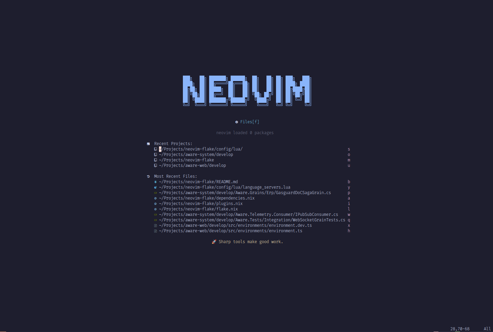
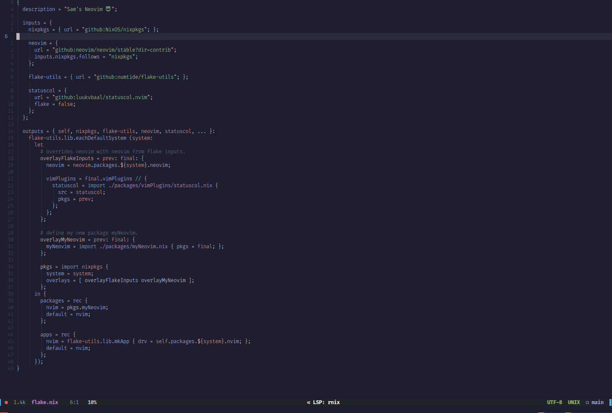
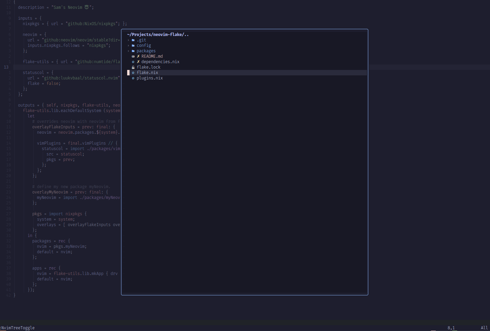

# My Neovim 😇

See: https://primamateria.github.io/blog/neovim-nix/#preface
and, https://github.com/PrimaMateria/blog-neovim-nix

## How to Run

From the repo: `nix run`

From anywhere with nix: `nix run github:samjwillis97/neovim-flake`

## Sample Pictures

## TODO

- Ominsharp currently broken see: https://github.com/OmniSharp/omnisharp-roslyn/issues/2483
- Investigate `vim.treesitter.query.get_node_text()`
- Fix debugger
- Cachix
- Provider different versions - full/minimal/languages
- Easier disabling/enabling of plugins/features
